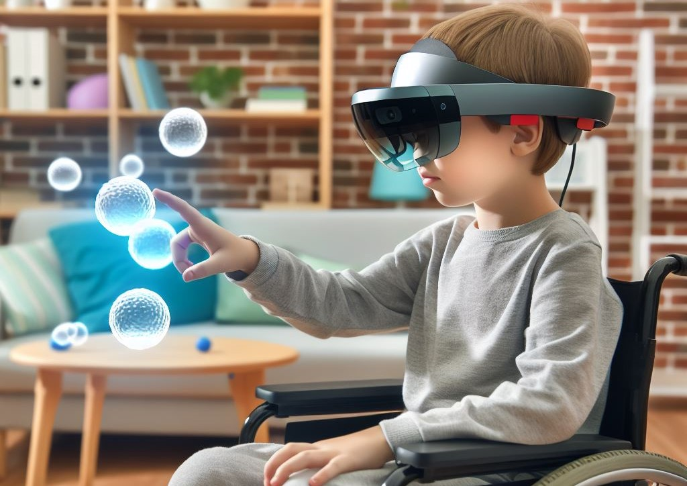

## 🎓 畢業專題：基於混合實境技術開發腦性麻痺兒童上肢運動訓練系統  
✨ **榮獲 2023 年「全國金腦獎盃創新發明與設計競賽」銀牌獎！** 

### 🌟 **專題介紹**
在本專案中，我們開發了一款 **混合實境 (MR) 肌力訓練系統**，專為 **腦性麻痺兒童** 設計，旨在 **提升復健訓練的趣味性與效果**，並改善患者的生活品質與學習成效。  

本系統基於 **Unity** 與 **C#** 開發，並透過 **HoloLens 2** 頭戴式裝置，將 **混合實境 (MR) 技術** 與 **遊戲化復健** 相結合，使患者能在 **虛實融合的環境** 中進行上肢運動訓練。透過沉浸式互動方式，提升患者參與訓練的積極性，進一步增強動作協調能力與復健成效。

  

---

### 🎯 **專案特色**
✅ **結合 MR 技術**：使用 **HoloLens 2** 創造 **沉浸式復健體驗**  
✅ **個人化訓練**：系統可根據使用者動作數據進行 **即時調整**  
✅ **遊戲化設計**：透過 **遊戲互動** 提高兒童復健的 **積極性**  
✅ **即時數據分析**：使用 **AI + 大數據分析**，記錄患者進步情況  

---

### 🛠️ **技術細節**
- **開發工具**：Unity、C#、HoloLens 2 SDK  
- **數據分析**：Python、機器學習模型  
- **互動方式**：手勢識別、眼動追蹤  
- **平台支援**：Windows MR、未來可拓展至 VR/AR 設備  

---

### 🏆 **競賽與榮譽**
🥈 **2023 國家金腦盃創新發明競賽 - 銀牌獎**  
🏅 **2023 技專校院學生實務專題製作競賽 - 佳作**  
💡 **2021 國家機器人創新應用競賽 - 第一名（團隊經驗）**  

---

### 💡 **未來發展**
這項技術未來可以應用於 **更多醫療復健領域**，例如：
- **肌力復健**：適用於 **腦中風、帕金森氏症患者**
- **運動訓練**：應用於 **職業運動員的肌力與協調訓練**
- **遠端復健系統**：搭配 **5G + AI** 讓病患在家中也能訓練  

---

  <h2>🚀 歡迎交流與合作！</h2>
  
如果你對這個專案有興趣，歡迎與我聯繫！

  <a href="mailto:your-email@example.com" style="font-size: 20px; background-color: #0078D7; color: white; padding: 10px 20px; border-radius: 8px; text-decoration: none;">📧 聯絡我</a>

